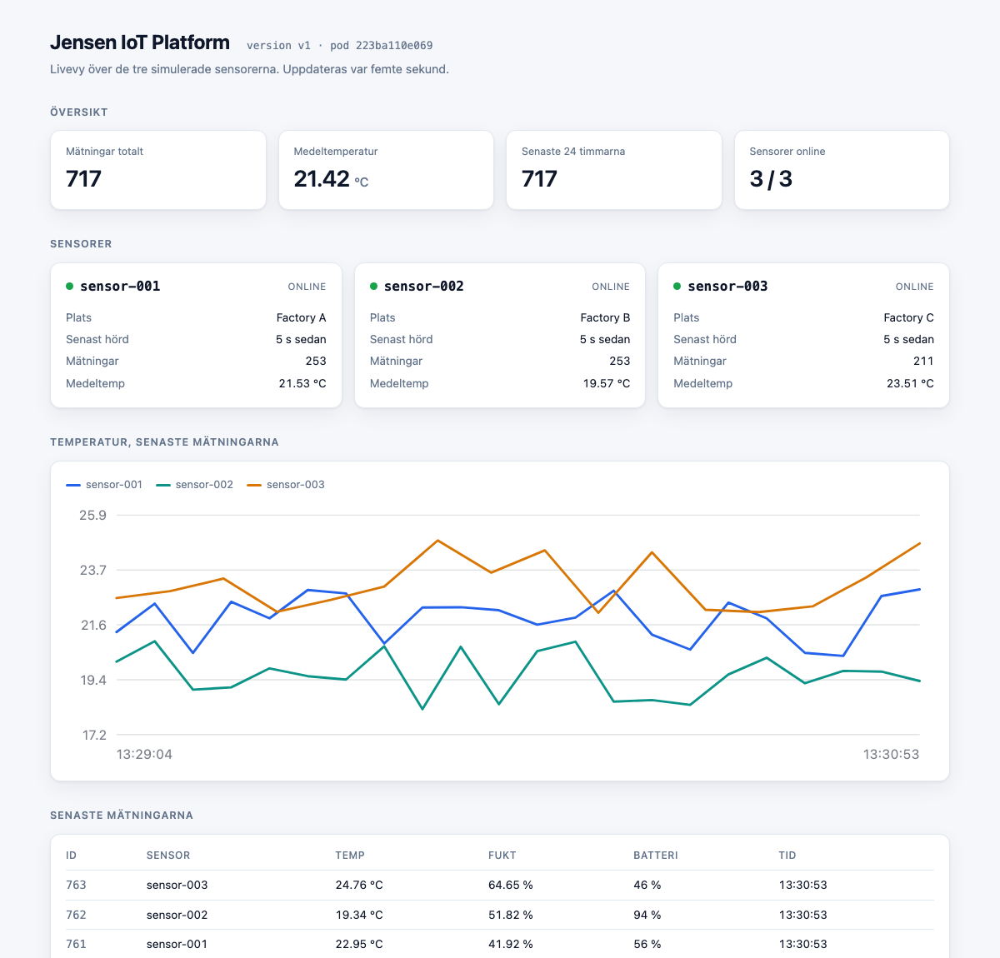

# Jensen IoT Platform

En IoT-plattform som tar emot mätvärden från tre simulerade sensorer, validerar
dem, lagrar historiken i PostgreSQL och cachar varje sensors senaste mätning i
Redis. Hela miljön körs med Docker Compose. API:t distribueras dessutom i
Minikube som en avgränsad Kubernetes-demo, och en CI-pipeline kör tester och
bygger imagen vid varje push.

Laboration i kursen DDM. Byggd utifrån kursens starter-repository.


Arkitekturen är beskriven i [docs/architecture.md](docs/architecture.md).

## Innehåll

- [Kom igång](#kom-igång)
- [Endpoints](#endpoints)
- [SQL-frågorna](#sql-frågorna)
- [Tester](#tester)
- [CI](#ci)
- [Kubernetes](#kubernetes)
- [Fördjupningar](#fördjupningar)
- [Kända begränsningar](#kända-begränsningar)
- [Projektstruktur](#projektstruktur)

## Kom igång

### Det som behövs

- Docker Desktop eller Docker Engine med Compose-plugin
- `kubectl` och Minikube, men bara för Kubernetes-delen

Python behöver inte installeras lokalt. Allt kör i containrar.

### Starta

```bash
docker compose up --build -d
docker compose ps
```

Fyra tjänster ska starta: `db`, `redis`, `api` och `simulator`. Databasen ska
visa `healthy` efter några sekunder. API:t väntar på den innan det startar.

Öppna sedan <http://localhost:5001>. Startsidan är en dashboard som visar
sensorernas status, en temperaturkurva och de senaste mätningarna. Den
uppdaterar sig var femte sekund.



### Följ sensorerna

```bash
docker compose logs -f simulator
```

Giltiga mätningar ger `201`. Sensor-003 skickar med flit trasig data ibland och
får då `400`. Det är meningen.

### Efter en kodändring

Källkoden kopieras in i imagen, så den uppdateras inte av sig själv:

```bash
docker compose up --build -d
```

### Stoppa

```bash
docker compose down      # data ligger kvar i volymen postgres_data
docker compose down -v   # raderar även databasen
```

## Endpoints

| Metod och sökväg | Beskrivning | Status |
|---|---|---|
| `GET /` | dashboard | `200` |
| `GET /health` | hälsokontroll, rör varken databas eller cache | `200` |
| `GET /health/dependencies` | visar om PostgreSQL och Redis svarar | `200`, `503` om databasen är nere |
| `GET /devices` | listar sensorerna | `200` |
| `GET /devices/status` | online eller offline per sensor | `200` |
| `GET /measurements` | de 100 senaste mätningarna | `200` |
| `GET /devices/<id>/measurements` | historik för en sensor | `200`, `404` vid okänd sensor |
| `GET /devices/<id>/latest` | senaste mätningen, via cache | `200`, `404` vid okänd sensor eller ingen mätning |
| `POST /measurements` | tar emot en mätning | `201`, `400` vid ogiltig data eller okänd sensor |
| `GET /statistics` | aggregerad statistik | `200` |

Några exempel:

```bash
curl localhost:5001/devices/sensor-001/latest
curl localhost:5001/statistics
curl -X POST localhost:5001/measurements \
  -H 'Content-Type: application/json' \
  -d '{"deviceId":"sensor-001","temperature":21.5,"humidity":45,"battery":90}'
```

### Statuskoder

`201` när mätningen faktiskt har sparats, med den skapade raden i svaret.

`400` vid ogiltig data. Alla fel rapporteras samtidigt, inte ett i taget:

```json
{"errors": ["temperature must be a number", "battery must be an integer"]}
```

Ett okänt `deviceId` ger också `400`, eftersom det är avsändaren som har fel.
Utan den kontrollen hade databasens främmande nyckel slagit till och felet
kommit ut som ett `500`.

`404` skiljer på två fall. En känd sensor utan mätningar är ett giltigt
tillstånd: historiken ger `200` och `[]`, medan senaste mätningen ger `404` med
`no measurement for device`. Ett okänt sensor-id ger `404` med `unknown device`.

`503` när databasen inte svarar, som JSON och inte som en Flask-felsida.

### Cachen

`GET /devices/<id>/latest` läser Redis först, går till PostgreSQL vid miss och
skriver tillbaka svaret till cachen. Svaret visar varifrån värdet kom:

```bash
docker compose exec redis redis-cli FLUSHDB
curl localhost:5001/devices/sensor-001/latest   # "source": "database"
curl localhost:5001/devices/sensor-001/latest   # "source": "cache"
```

Nycklarna heter `latest:<deviceId>` och lever i fem minuter:

```bash
docker compose exec redis redis-cli KEYS "latest:*"
```

Redis-fel fångas inne i `cache.py` och blir en cache miss. Ett nedsläckt Redis
gör lösningen långsammare, inte trasig.

## SQL-frågorna

Samtliga frågor finns i [docs/queries.sql](docs/queries.sql) med kommentarer om
vad de gör och varför. De tre obligatoriska är antal mätningar med `COUNT`,
medeltemperatur med `AVG` och mätningar från de senaste 24 timmarna.

Kör dem:

```bash
docker compose exec -T db psql -U student -d jensen_iot < docs/queries.sql
```

Utskriften från en körning ligger i
[docs/evidence/sql-output.txt](docs/evidence/sql-output.txt).

## Tester

```bash
docker compose exec api python -m pytest -q
```

34 tester i två grupper.

`tests/test_validation.py` testar valideringen som ren funktion, utan databas.
Utöver de obligatoriska fallen finns kantfall som att `bool` inte får räknas som
tal och att flera fel rapporteras tillsammans.

`tests/test_integration.py` går genom hela kedjan med Flasks testklient mot en
riktig PostgreSQL och Redis: statuskoder, skillnaden mellan tom och okänd
sensor, cache miss efter tömning och att en ny mätning uppdaterar cachen.
Testerna skapar en egen sensor och städar bort den efteråt, så de rör aldrig
simulatorns data. Saknas PostgreSQL eller Redis hoppar de över sig själva i
stället för att fallera.

## CI

[`.github/workflows/ci.yml`](.github/workflows/ci.yml) kör vid push och pull
request:

1. hämtar koden
2. installerar `api/requirements.txt`
3. lägger på databasschemat
4. kör hela testsviten
5. bygger `jensen-iot-api:ci`
6. startar den byggda imagen och kontrollerar att `/health` svarar

PostgreSQL och Redis körs som service-containrar med samma images som i
Compose. Utan dem hade integrationstesterna hoppat över sig själva och
pipelinen blivit grön utan att ha testat något som spelar roll.

## Kubernetes

Demon kör bara API:t. PostgreSQL, Redis och simulatorn ingår inte, så det är
startsidan och `/health` som används.

```bash
minikube start --driver=docker
minikube image build -t jensen-iot-api:lab ./api
kubectl apply -f k8s/deployment.yaml
kubectl apply -f k8s/service.yaml
kubectl get pods
minikube service jensen-iot-api
```

### Self-healing

```bash
kubectl delete pod <podnamn>
kubectl get pods
```

Poden kommer inte tillbaka. En ny skapas med ett nytt namn, och den skapas redan
medan den gamla stänger ner. Se
[docs/evidence/kubernetes-self-healing.txt](docs/evidence/kubernetes-self-healing.txt).

### Scaling

```bash
kubectl scale deployment jensen-iot-api --replicas=5
kubectl get pods
kubectl scale deployment jensen-iot-api --replicas=3
```

Se [docs/evidence/kubernetes-scaling.txt](docs/evidence/kubernetes-scaling.txt).

### Avsluta

```bash
minikube stop
```

## Fördjupningar

Sju av de valfria uppgifterna är genomförda.

**`/statistics`.** Totaler, nedbrytning per sensor samt varmaste och mest aktiva
sensor. Implementerad i `get_statistics()` i `api/db.py`.

**Online- och offlinestatus.** `GET /devices/status` räknar en sensor som online
om dess senaste mätning kom in inom 30 sekunder. Statusen härleds ur mätdatan i
stället för att sensorn skickar en egen heartbeat, vilket gör att den fungerar
även för en sensor som inte kan rapportera att den mår dåligt. En `LEFT JOIN`
gör att en sensor helt utan mätningar också kommer med, som offline.

**Sensorn med högst medeltemperatur.** Fråga 4 i `docs/queries.sql`. Sensor-003
ligger högst.

**Mest aktiv sensor.** Fråga 5 i `docs/queries.sql`. Måttet räknar sparade
mätningar, inte skickade, så sensor-003 hamnar sist trots att den skickar lika
ofta som de andra. Dess trasiga rader stoppas av valideringen och når aldrig
databasen. Det är just den skillnaden som gör måttet intressant.

**Dashboard.** Startsidan visar sensorstatus, statistik, en temperaturkurva och
de senaste mätningarna. Allt är inbakat i sidan, ingen CDN och inget
diagrambibliotek. Kurvan ritas som SVG direkt av datan. Sidan hämtar sina tre
endpoints med `Promise.allSettled`, så en trasig del tömmer inte hela sidan, och
nås ingen av dem visas en banner i stället. Det är precis läget i
Kubernetes-demon.

**Integrationstester.** Beskrivna under [Tester](#tester).

**Rolling update och rollback.** En ny version rullas ut med `kubectl patch` och
rullas tillbaka med `kubectl rollout undo`. Under förloppet anropade en separat
Pod Servicen två gånger per sekund: 200 anrop, noll misslyckade, och
versionsfältet i svaren gick från `lab` till `lab-v2` och tillbaka mitt under
trafiken. `maxUnavailable: 0` och readinessProbe är det som gör bytet omärkbart.
Se [docs/evidence/kubernetes-rolling-update.txt](docs/evidence/kubernetes-rolling-update.txt).

## Kända begränsningar

**PostgreSQL är en enskild felkälla.** En container med en volym. Faller den
stannar allt och nya mätningar går förlorade. Det räcker för labben men hade
krävt säkerhetskopior och replikering i skarp drift.

**Kubernetes-demon kör bara API:t.** Databasberoende endpointer fungerar inte i
klustret. Att köra PostgreSQL där hade krävt StatefulSet och
PersistentVolumeClaim, vilket ligger utanför uppgiften.

**Alla repliker kör på samma nod.** Minikube är ett kluster med en nod. Self-
healing och scaling fungerar och går att visa, men faller noden faller allt.

**Ingen autentisering.** Vem som helst som når API:t kan posta mätningar och
läsa all data. Ett riktigt system hade behövt någon form av nyckel per sensor.

**`GET /measurements` har `LIMIT 100` utan paginering.** Det räcker för
dashboarden, men det finns inget sätt att bläddra bakåt i historiken via API:t.

**Ingen rate limiting.** En trasig sensor som postar i en tät slinga skulle
kunna fylla databasen.

**`created_at` är `TIMESTAMP` utan tidszon.** Databassessionen låses till UTC
och API:t märker tidsstämplarna med `+00:00` innan de skickas, vilket löser
problemet i praktiken. `TIMESTAMPTZ` hade varit renare men innebär en
schemaändring.

## Projektstruktur

```
api/
  app.py                    endpoints och statuskoder
  db.py                     SQL-frågor och anslutning
  cache.py                  Redis, cache-aside
  validation.py             valideringsregler
  templates/index.html      dashboard
  tests/                    enhets- och integrationstester
simulator/simulator.py      tre simulerade sensorer
database/init.sql           tabeller och startdata
k8s/                        Deployment och Service
docs/
  architecture.md           arkitektur och motiveringar
  architecture.png / .pdf   arkitekturdiagram
  reflection.md             reflektionsfrågorna
  queries.sql               samtliga SQL-frågor
  evidence/                 utskrifter från körningarna
  lab-guide.md              kursens instruktioner
docker-compose.yml
.github/workflows/ci.yml
```
