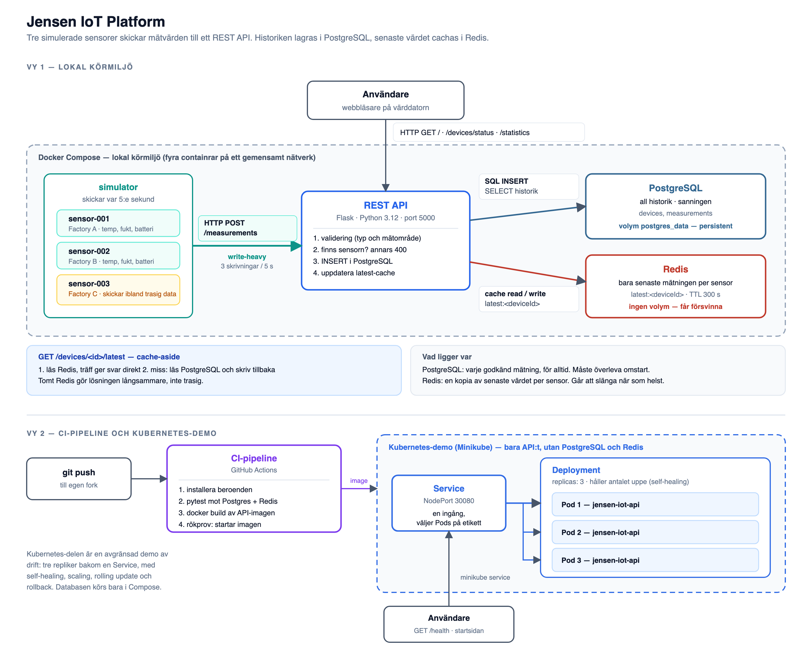

# Arkitektur

Diagrammet finns också som [PDF](architecture.pdf) för utskrift, och källan
ligger i [architecture.svg](architecture.svg) om något behöver ändras.

Diagrammet är uppdelat i två vyer eftersom lösningen körs i två olika miljöer
som inte hänger ihop. Vy 1 är den fullständiga lösningen i Docker Compose. Vy 2
är CI-pipelinen och den avgränsade Kubernetes-demon, som bara kör API:t.

## Vy 1, lokal körmiljö

Fyra containrar på ett gemensamt Docker-nätverk.

**Simulatorn** kör tre sensorer som var femte sekund skickar temperatur,
luftfuktighet och batterinivå med `HTTP POST /measurements`. Det är lösningens
tunga flöde: tre skrivningar var femte sekund, dygnet runt, mot i praktiken
enstaka läsningar. Sensor-003 skickar med flit trasig data ibland, vilket gör
att valideringen får något att arbeta med.

**REST API:t** gör fyra saker med varje inkommande mätning, i den ordningen:
validerar typer och mätområden, kontrollerar att sensorn finns, sparar i
PostgreSQL och uppdaterar cachen. Ordningen spelar roll. Valideringen ligger
före databasen så att skräp aldrig hinner sparas, och kontrollen av sensorn
ligger före insert så att ett okänt `deviceId` blir ett tydligt `400` i stället
för att slå i databasens främmande nyckel och komma ut som ett `500`.

**PostgreSQL** håller all historik och är lösningens sanning. Databasen skriver
till den namngivna volymen `postgres_data`, som lever vidare när containern tas
bort. Det är det enda i lösningen som måste överleva en omstart.

**Redis** håller en kopia av varje sensors senaste mätning under nyckeln
`latest:<deviceId>`, med fem minuters TTL. Cachen innehåller ingenting som inte
redan finns i PostgreSQL, och den har ingen volym. Den får försvinna.

**Användaren** når API:t utifrån, från en webbläsare på värddatorn. Startsidan
är en dashboard som hämtar `/statistics`, `/devices/status` och `/measurements`
och ritar upp dem.

### Cache-aside

`GET /devices/<id>/latest` läser Redis först. Vid träff svarar API:t direkt. Vid
miss läser det PostgreSQL, skriver tillbaka svaret till Redis och svarar. Varje
`POST` uppdaterar dessutom cachen, så att en läsning strax efter en skrivning
inte får ett gammalt värde.

Svaret innehåller ett fält `source` som visar om värdet kom från `cache` eller
`database`. Det fältet gjorde det enkelt att verifiera att cachen faktiskt
används, och det är samma fält integrationstesterna kontrollerar.

## Vy 2, CI och Kubernetes

**CI-pipelinen** startar vid varje push. Den installerar beroenden, kör
testerna mot en riktig PostgreSQL och Redis som service-containrar, bygger
API:ts Docker image och startar den byggda imagen för att kontrollera att den
går att köra.

**Kubernetes-demon** kör bara API:t, i tre repliker bakom en Service. PostgreSQL
och Redis ingår inte. Det är därför `/health` och startsidan används i demon och
inte de databasberoende endpointerna.

## Val som är värda att motivera

**`/health` rör varken databasen eller cachen.** Det är avsiktligt. I
Kubernetes-demon finns ingen databas, och en hälsokontroll som krävde en sådan
hade gjort att ingen Pod någonsin blev READY. Beroendenas status rapporteras
i stället av `/health/dependencies`, som används i Compose-miljön.

**Ett nedsläckt Redis får inte ta ner API:t.** Alla Redis-anrop fångas i
`cache.py` och översätts till en cache miss. Läsningarna går då till PostgreSQL
i stället. Lösningen blir långsammare, inte trasig.

**Åldern på en mätning räknas av databasen.** `/devices/status` returnerar
`seconds_since_last_seen`, uträknat med `EXTRACT(EPOCH FROM (NOW() - last_seen))`.
Det första försöket räknade i webbläsaren i stället, vilket gav två timmars fel
eftersom `created_at` saknade tidszon och JavaScript tolkade den som lokal tid.
Nu låses databassessionen till UTC och API:t märker tidsstämplarna med `+00:00`.

**maxUnavailable är 0 i Deploymenten.** Under en rolling update startas en ny
Pod innan en gammal tas bort, så antalet fungerande Pods går aldrig under tre.
Mätningen i [evidence/kubernetes-rolling-update.txt](evidence/kubernetes-rolling-update.txt)
visar 200 anrop under en utrullning och en rollback, utan ett enda tappat.
